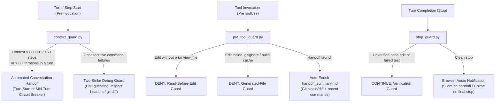

# Long-Context Error & Hallucination Prevention System for Jetski

As an LLM conversation grows beyond ~150k tokens or drags through dozens of consecutive debugging iterations in a single turn, model quality degrades noticeably: the agent starts forgetting constraints, making blind edits from memory, repeating failed hypotheses in a loop, or modifying build-cache artifacts instead of tracked source files.

To eliminate these failure modes, this setup implements a **multi-layered mechanical guardrail system**. Instead of relying on prompt instructions alone, it enforces strict invariants across three lifecycle hooks (`PreInvocation`, `PreToolUse`, and `Stop`) paired with always-on workspace rules.

---

## System Architecture

### Components
- **Hook Configuration**: [`hooks.json`](../hooks.json) (`~/.gemini/config/hooks.json`)
- **Context & Debug Loop Guard (`PreInvocation`)**: [`context_guard.py`](../hooks/context_guard.py)
- **Preventive Tool Guard (`PreToolUse`)**: [`pre_tool_guard.py`](../hooks/pre_tool_guard.py)
- **Verification & Completion Guard (`Stop`)**: [`stop_guard.py`](../hooks/stop_guard.py)
- **Context Hygiene Rule**: [`subagent_exploration.md`](../rules/subagent_exploration.md)

---

## 1. Proactive Context Hygiene & Subagent Delegation

**Problem**: Reading 10–20 source files in the main conversation to explore an unfamiliar subsystem or trace a call graph rapidly pollutes the primary context window with raw file contents.

**Solution ([`subagent_exploration.md`](../rules/subagent_exploration.md))**:
1. **Delegate Broad Exploration to Subagents (`invoke_subagent`)**: Whenever exploring an unfamiliar subsystem or inspecting more than 3–4 files, the main agent spawns an isolated subagent (`self`). The subagent performs the broad search in its own disposable context and returns only a concise summary with exact file paths and line numbers.
2. **Read Definitions Before Writing Calls**: The agent must never guess class methods, function signatures, struct fields, or CLI flags from memory; it is required to inspect the declaration (`.h`, `.hpp`, `.py`, `.dart`, etc.) or run `--help` first.

---

## 2. Automated Context Monitoring & Seamless Conversation Handoff (`PreInvocation`)

**Problem**: Once a conversation grows too large or gets stuck in a long debugging turn, context rot sets in. Manually summarizing and starting a new chat is tedious and prone to losing state.

**Solution ([`context_guard.py`](../hooks/context_guard.py))**:
1. **Two Handoff Modes**:
   - **Turn-Start Handoff (`invocationNum == 0`)**: When the full transcript reaches `600 KB` (~150k tokens) or `160 steps` (`MAX_STEPS`) at the beginning of a user turn, the hook allows the agent to answer the current request, then instructs it to write a structured handoff summary (`handoff_summary_<Topic>_<short_id>.md`) and launch a continuation conversation.
   - **Mid-Turn Circuit Breaker (`invocationNum > 0`)**: If the context crosses the threshold mid-turn OR a single turn exceeds `80` consecutive tool-call iterations (`MAX_TURN_INVOCATIONS`), the hook triggers an immediate safe-checkpoint stop. The agent must leave edited files in a valid state, terminate any background tasks/subagents, record both completed steps and **discarded/failed hypotheses** (so the next chat does not repeat dead-end loops), and immediately transition to a fresh conversation.
2. **Automatic Project & Title Continuity**:
   - The new conversation automatically inherits the active project binding (`ANTIGRAVITY_PROJECT_ID`), is named `[HH:MM continue] <Original Title>` (using the configured local timezone via `JETSKI_TIMEZONE`, defaulting to `America/New_York`), and receives an initial prompt instructing it to read the handoff summary artifact and continue from the exact next step.
   - Once a conversation hands off, the old chat is mechanically locked against further edits or duplicate launches, and completion is blocked if the agent writes a summary but forgets to launch the continuation chat.
   - If the agent spends a step terminating background tasks before writing the summary, follow-up reminders check `os.path.exists(handoff_file)` and require creating `handoff_summary_*.md` first before launching the continuation chat.

---

## 3. Two-Strike Debug Loop Guard (`PreInvocation`)

**Problem**: When a build or test fails, models often fall into a "trial-and-error spiral"—making a third, fourth, and fifth speculative edit without understanding the root cause.

**Solution ([`context_guard.py`](../hooks/context_guard.py))**:
- The hook tracks consecutive non-zero exit codes from `run_command` within the current turn (ignoring benign exit code `1` from search/diff tools like `grep`, `rg`, `git diff`, and `git check-ignore`).
- As soon as **2 commands in a row fail**, the hook injects an ephemeral warning (`[TWO-STRIKE DEBUG GUARD]`):
  > *"Warning: 2 consecutive commands in the current turn failed. DO NOT make a third blind guess! Stop, read the exact error output and source declarations (`.h` / docs), revert broken edits if needed (`git diff` / `git checkout`), and revise your hypothesis before proceeding."*

---

## 4. Preventive Tool-Call Guards (`PreToolUse`)

[`pre_tool_guard.py`](../hooks/pre_tool_guard.py) intercepts file modification and command execution tools **before** they run:

### 4.1. Read-Before-Edit Guard
- **Problem**: After a conversation handoff or late in a long session, the agent may try to edit an existing source file using `replace_file_content` based solely on a summary or memory, without viewing the actual lines in the current chat.
- **Solution**: If the target source file already exists on disk and has never been read via `view_file` (or created via `write_to_file`) in the **current conversation**, the edit call is **denied** until the agent reads the file first.

### 4.2. Generated & Gitignored File Guard
- **Problem**: In large builds (e.g., Flutter Engine / CMake), copies of source files or generated headers exist inside build caches (`bin/cache/`, `.dart_tool/`, `CMakeFiles/`). An agent can accidentally edit the cached copy instead of the tracked repository file.
- **Solution**: Every edit to a source file is checked against known build-cache paths and `git check-ignore`. If the file is ignored by Git or resides in a build cache, the edit is **denied** with instructions to modify the tracked source file instead.

### 4.3. Handoff Verification, Summary Enrichment & Zombie Task Cleanup
- **Problem**:
  1. An agent under a mid-turn circuit breaker might call `agentapi new-conversation` before creating `handoff_summary_*.md` on disk, leaving the continuation chat without context.
  2. An LLM-written handoff summary might omit a modified file or misreport the status of the last build command, forcing the new conversation to waste context inspecting old logs.
  3. An agent might spawn `tail -f` with `IsDaemon: true` on a task log, which never terminates on its own and leaves the old conversation spinning after handoff.
- **Solution**:
  - **Mandatory Summary Existence Check**: If `agentapi new-conversation` references a `handoff_summary_*.md` file that does not exist on disk yet, the command is **denied** until the agent writes the summary via `write_to_file`.
  - **Zombie Daemon Prevention & Cleanup**: Running `tail -f` as a background daemon (`IsDaemon: true`) or on `.system_generated/tasks/` logs is **denied**. Additionally, when `agentapi new-conversation` executes, any lingering processes referencing the old conversation's `.system_generated/tasks/` directory are automatically terminated (`pkill -f`).
  - **Objective Snapshot Enrichment**: Right as `agentapi new-conversation` is invoked, `pre_tool_guard.py` automatically appends a machine-generated snapshot section to `handoff_summary_*.md` containing:
    - The exact list of project files modified by edit tools in the conversation;
    - The last 6 executed commands along with their exit codes;
    - The output of `git status -s -uno` and `git diff --stat` across active workspaces.

---

## 5. Mandatory Edit Verification Guard (`Stop`)

**Problem**: The agent modifies source code and immediately reports completion to the user without compiling or running tests—or stops even though the last test command failed.

**Solution ([`stop_guard.py`](../hooks/stop_guard.py))**:
- When the agent attempts to finish its turn (`MODEL_STOP`), the hook inspects the turn trajectory:
  - If any tracked source file (`.c`, `.cpp`, `.h`, `.py`, `.rs`, `.go`, `.ts`, `.dart`, `.gn`, `BUILD.bazel`, `CMakeLists.txt`, etc.) was modified and **no verification command (`run_command`) was executed after the last edit**, the stop is blocked (`decision: "continue"`) and the agent is required to run a build, test, or syntax check first.
  - If the last command after a code edit exited with a **non-zero code**, the stop is similarly blocked until the agent fixes the failure or reverts the broken change.

---

## 6. Distinct Browser Audio Behavior for Handoff vs. Task Completion

**Problem**: Jetski Web plays a completion chime (`/antigravityCascadeDone.mp3`) in the local browser whenever a conversation transitions to `idle`. During an automated mid-task handoff, the old conversation goes `idle` while the new conversation starts working—causing a false "task finished" chime.

**Solution (`stop_guard.py` + `context_guard.py`)**:
- On an **automated handoff** to a continuation conversation, `stop_guard.py` briefly toggles `userSettings.enableSoundsForSpecialEvents` to `false` in `~/.gemini/config/config.json` (which `jetski-hub-server` watches via `fsnotify` and streams to the browser before the `idle` transition) and restores it to `true` after 2 seconds (with an additional safety reset at turn start in `context_guard.py`). The handoff occurs **silently** without distracting the user.
- On a **genuine task stop**, `userSettings.enableSoundsForSpecialEvents` is guaranteed to be `true`, so the browser plays the completion chime only when the agent has actually finished its work or needs user input.
